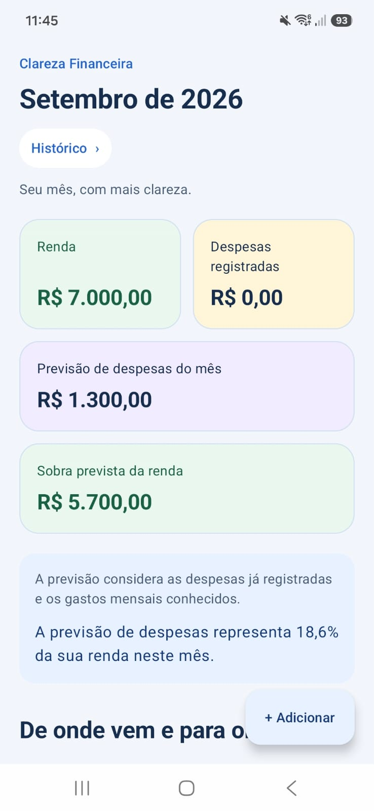
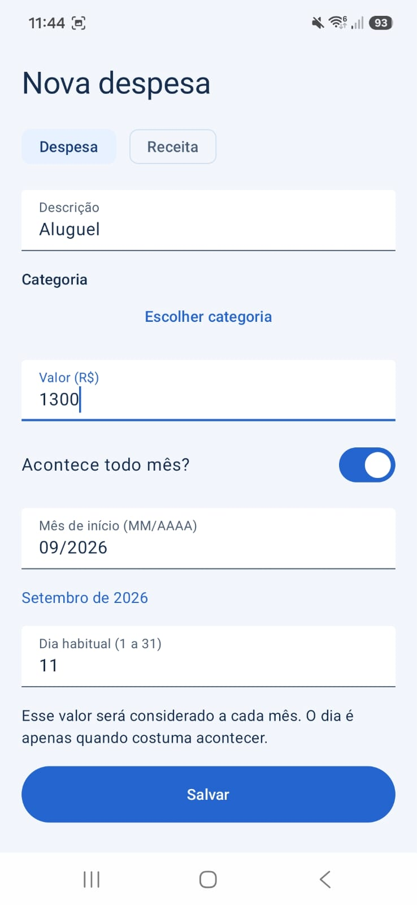
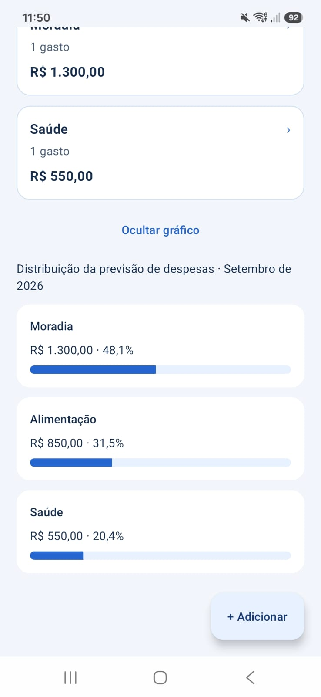
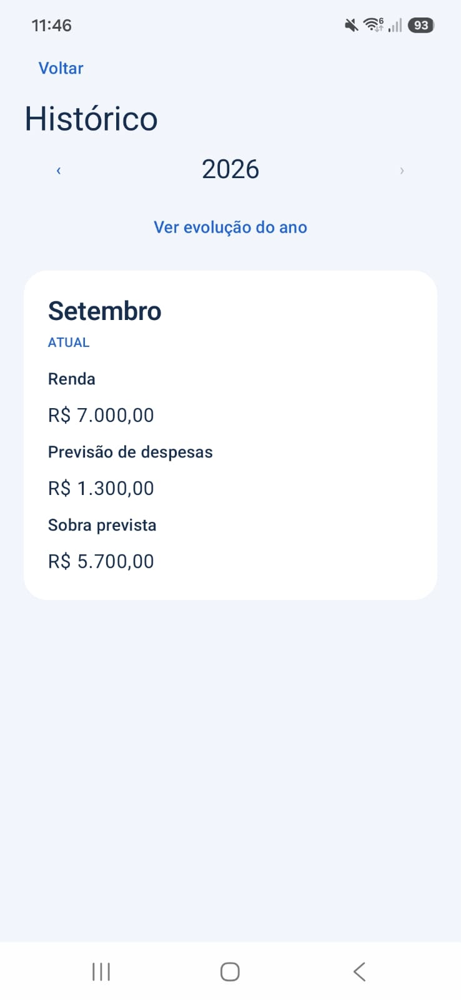

# Clareza Financeira

Um aplicativo Android para ajudar a pessoa a entender rapidamente sua situação financeira e para onde seu dinheiro está indo, com o mínimo de esforço possível. Pensado para quem quer compreender as finanças do mês sem precisar de uma ferramenta complexa.

**Abriu o aplicativo → bateu o olho → entendeu.**


[](docs/estado-do-mvp.md)
[](docs/produto-atual.md#estado-atual)
[](docs/produto-atual.md#estado-atual)
[](LICENSE)

<p align="center">
  
</p>

## Principais funcionalidades

- Cadastro, edição e exclusão de rendas e despesas pontuais ou recorrentes mensais.
- Alteração de recorrências somente em uma ocorrência ou a partir de um período, além de interrupção e exclusão com alcance explícito.
- Dashboard com renda, despesas registradas, previsão mensal, sobra prevista e percentual da renda comprometida quando aplicável.
- Fontes de renda e categorias fixas de despesas, com detalhamento dos itens.
- Histórico financeiro por ano e mês, com consulta e edição de registros existentes.
- Gráficos opcionais de distribuição das despesas e evolução anual.
- Persistência local dos dados, sem conta do produto ou sincronização própria entre dispositivos.

Os dados financeiros são locais e estão excluídos do backup em nuvem do Android. O sistema pode transferir o histórico completo diretamente entre aparelhos quando houver suporte. Essa transferência não é sincronização nem garantia de recuperação: perder o aparelho pode significar perder o histórico se não houver transferência disponível.

## Como funciona

**Renda − Previsão de despesas = Sobra prevista**

Cada mês tem sua própria análise. A sobra de um período não é transferida automaticamente para o seguinte: o aplicativo acompanha **fluxo financeiro mensal**, não saldo bancário ou patrimônio.

As **despesas registradas** são movimentações pontuais efetivamente cadastradas. A **previsão de despesas** reúne esses registros e as recorrências válidas para o mês. A renda considerada também inclui entradas pontuais e recorrentes válidas.

Sem renda informada, as despesas continuam visíveis, mas a sobra prevista e o percentual da renda ficam indisponíveis. A previsão utiliza os dados fornecidos pela pessoa, sem estimar gastos desconhecidos.

Consulte as [regras do produto](docs/regras-do-produto.md) para entender o comportamento completo.

## Conheça o aplicativo

<table>
  <tr>
    <td align="center">
      <br>
      Cadastro de despesa recorrente
    </td>
    <td align="center">
      <br>
      De onde vem e para onde vai
    </td>
  </tr>
  <tr>
    <td align="center">
      <br>
      Distribuição da previsão de despesas
    </td>
    <td align="center">
      <br>
      Histórico financeiro
    </td>
  </tr>
</table>

## Tecnologias e arquitetura

| Área | Tecnologias |
| --- | --- |
| Plataforma e linguagem | Android e Kotlin |
| Interface | Jetpack Compose e Material 3 |
| Estado e navegação | ViewModel, Navigation Compose, Coroutines, Flow e StateFlow |
| Persistência | Room sobre SQLite, com KSP |
| Build | Gradle Wrapper e Kotlin DSL |
| Testes | JUnit, Robolectric, Coroutines Test e testes Compose |

O projeto possui um módulo Android, `:app`, organizado em pacotes de apresentação, domínio e dados. Compose representa a interface; ViewModels mantêm seu estado; repositories coordenam persistência e análise. Room/SQLite armazena os fatos financeiros, e a `MonthlyAnalysisEngine` realiza a análise mensal de forma pura.

As dependências são compostas manualmente. Veja responsabilidades e decisões técnicas em [arquitetura atual](docs/arquitetura-atual.md).

## Estado do projeto

**Clareza Financeira RC1 — APROVADO.**

O MVP (FEAT 00–11), os refinamentos pós-MVP planejados para esta versão, a preparação open source e o Release Candidate Gate (REF06) estão concluídos.

O REF06A foi **APROVADO COM OBSERVAÇÕES PARA HOMOLOGAÇÃO FÍSICA**: **301/301 testes aprovados**, sem falhas, erros ou ignorados; builds Debug e Release aprovados; Android Lint com **0 erros e 11 warnings**, somente de versões disponíveis. O REF06B foi **APROVADO** após instalação e validação em dispositivo Android físico, sem crash ou bloqueador encontrado. Não existem bloqueadores conhecidos para o RC1.

O próximo passo é a **preparação para distribuição pública**. O APK Release gerado ainda está **não assinado**; assinatura e preparação do artefato permanecem pendentes. RC1 é uma versão candidata, não a v1.0 nem uma declaração de distribuição pública ou publicação em loja concluída.

O [registro do RC1](docs/produto-atual.md#estado-atual) reúne os resultados e observações. O [estado do MVP](docs/estado-do-mvp.md) preserva a fotografia histórica do encerramento após a FEAT 11.

## Como executar

O projeto usa **Gradle Wrapper 9.5.0** e **Android Gradle Plugin 9.3.2**. Configure um Android Studio e um JDK compatíveis com essas ferramentas.

A compatibilidade de compilação declarada é **Java 17**. O ambiente Gradle local investigado utiliza **JDK 21**; isso registra a configuração utilizada, sem estabelecer JDK 21 como requisito universal.

1. Clone este repositório:

   ```sh
   git clone https://github.com/Maiquel-Devs/clareza-financeira.git
   cd clareza-financeira
   ```
2. Abra a pasta raiz no Android Studio.
3. Configure o JDK do Gradle e sincronize usando o Wrapper incluído no projeto, sem substituir sua versão.
4. Disponibilize o **Android SDK Platform 37** pelo SDK Manager e conclua a sincronização. O módulo declara `compileSdk = 37` e `targetSdk = 37`.
5. Selecione um dispositivo físico ou emulador com **API 26 ou superior**, conforme `minSdk = 26`.
6. Execute o módulo **app** pelo Android Studio.

A sincronização inicial precisa baixar as dependências. Não há backend ou conta do produto para configurar. O namespace e o applicationId são `com.clarezafinanceira.app`.

O caminho do SDK é local: deixe o Android Studio criar `local.properties` ou configure `ANDROID_HOME` para o SDK instalado. Não versione `local.properties`. Para usar o terminal, configure `JAVA_HOME` para um JDK compatível com o Gradle/AGP do projeto. O build debug usa a assinatura de desenvolvimento gerada localmente pelo Android SDK; não exige uma chave privada do mantenedor.

Para gerar o APK debug pelo terminal, use `.\gradlew.bat assembleDebug` no Windows ou `./gradlew assembleDebug` no macOS/Linux. O resultado fica em `app/build/outputs/apk/debug/`.

## Testes

O REF06A homologou **301 testes em 29 classes, todos aprovados**, com **0 falhas, 0 erros e 0 ignorados**. A suíte cobre regras financeiras, persistência, repositories, estado, formulários, navegação, apresentação e política de backup; os testes locais ficam em `app/src/test/` e não exigem emulador.

No Windows / PowerShell, execute na raiz do projeto:

```powershell
.\gradlew.bat testDebugUnitTest
.\gradlew.bat test build lint
```

O primeiro comando executa os testes unitários debug; o segundo reúne testes, build e lint e pode ser reservado para uma validação ampla. Em macOS/Linux, use `./gradlew testDebugUnitTest` ou `./gradlew test build lint`, respectivamente. A homologação registrada foi realizada no ambiente Windows; a contagem acima é um marco documentado, não um status de execução contínua.

## Documentação

| Documento | Conteúdo |
| --- | --- |
| [Produto atual](docs/produto-atual.md) | Visão, capacidades, escopo e registro do RC1 |
| [Regras do produto](docs/regras-do-produto.md) | Invariantes e comportamento financeiro |
| [Arquitetura atual](docs/arquitetura-atual.md) | Organização técnica e responsabilidades |
| [Fluxos e UX](docs/fluxos-e-ux.md) | Experiência, navegação e decisões de interface |
| [Estado do MVP](docs/estado-do-mvp.md) | Fotografia histórica da homologação e das observações após a FEAT 11 |

Os documentos consolidados descrevem o estado atual. A pasta [historico](docs/historico/) preserva os registros da evolução e das etapas de implementação; [tecnico](docs/tecnico/) reúne documentação técnica específica de apoio, com contexto das entregas originais.

## Roadmap

**MVP concluído → Consolidação concluída → Refinamentos pós-MVP + preparação open source concluídos → Release Candidate Gate concluído → RC1 aprovado → Preparação para distribuição pública → Validação com usuários reais → v1.0**

**Próximo passo: preparação para distribuição pública.** A validação com usuários reais e a v1.0 são etapas futuras. A evolução do produto será orientada pelo feedback real; a aprovação do RC1 não conclui essas etapas.

## Open source

O Clareza Financeira adota a **MIT License**. Consulte o [guia de contribuição](CONTRIBUTING.md) para preparar o ambiente, validar uma alteração e abrir um Pull Request.

## Licença

Este projeto é distribuído sob a [MIT License](LICENSE).

Copyright (c) 2026 Maiquel.
